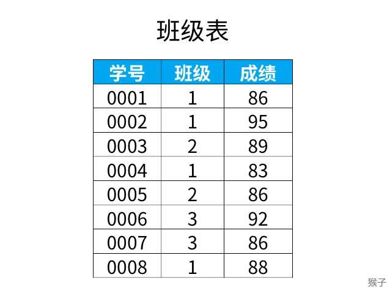

## 数据（成绩）排名
> 取出表中的成绩，并且排序，当分数相同时，排名保持相同，同时下一个排名对比这个是没有间隔的

**解题思路：**
**1. 涉及到排名问题，可以使用窗口函数**
**2. 窗口函数 rank, dense_rank, row_number 的区别**

```sql
select  *, 
rank() over(order by 成绩 desc) as ranking,
dense_rank() over(order by 成绩 desc) as dese_rank,
row_number() over(order by 成绩 desc) as row_num  from 表.
```
