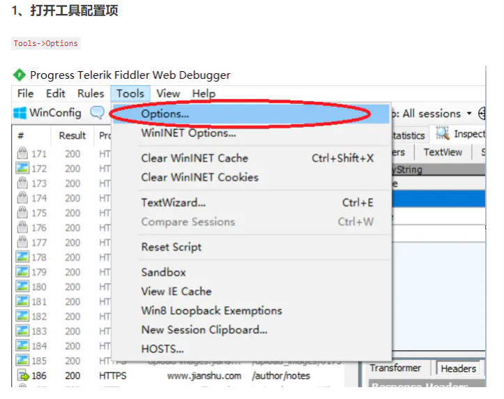
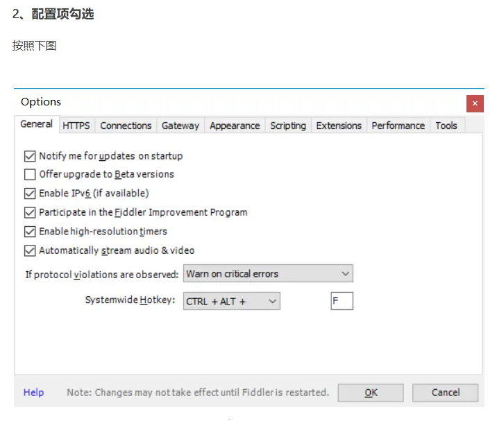
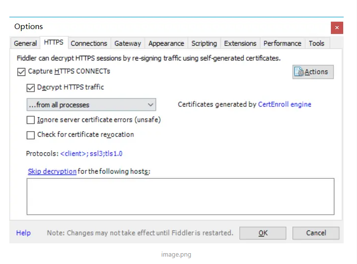
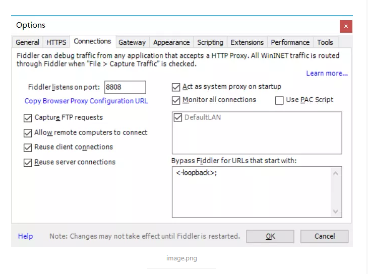
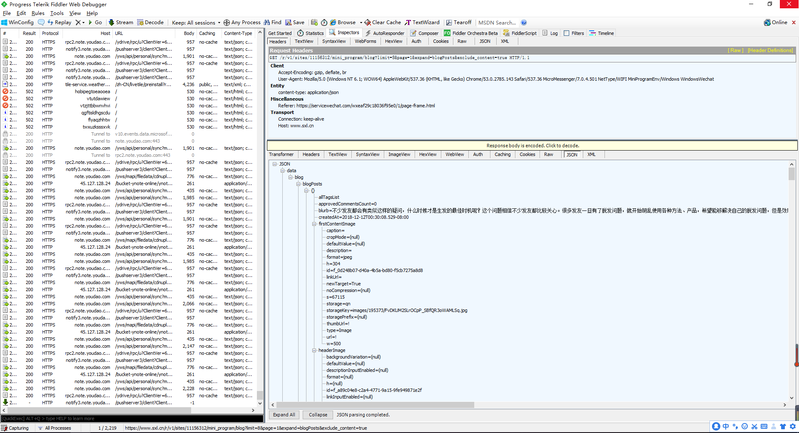
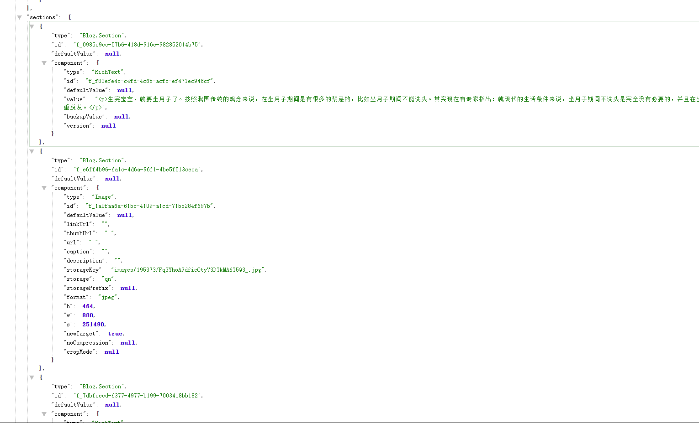

## Fiddler工具使用












## 通过Fiddler抓取微信小程序的文章 (案例)

```php
<?php
for($i=0; $i<20; $i++ ){
 // 抓取文章的链接
$loginUrl = 'https://www.sxl.cn/r/v1/sites/11156312/mini_program/blog?limit=8&page='.$i.'&expand=blogPosts&exclude_content=true%20200%20OK%20(application/json)';
$ch = curl_init();
curl_setopt($ch, CURLOPT_SSL_VERIFYPEER, false);
curl_setopt($ch, CURLOPT_RETURNTRANSFER, true);
curl_setopt($ch, CURLOPT_URL,$loginUrl);
$result=curl_exec($ch);
    curl_close($ch);
// 如果文章有值的话
if(isset($result)){
    for($a=0;$a<8;$a++){
        // json 解析为对象格式的   获取标题 $res
        $res = json_decode($result)->data->blog->blogPosts[$a]->content->header->title->value;
        // 写入到文件中  设置为追加写入 FILE_APPEND
        file_put_contents('./article/'.$i.".txt", $res, FILE_APPEND);
        //  json把文章解析为对象格式
        $data = json_decode($result)->data->blog->blogPosts[$a]->content->sections;
        foreach($data as $k=>$v){   // 循环获取文章的数据
            if(isset($v->component->value)){
                $shuju = $v->component->value;
                // 写入文件中 .PHP_EOL 为换行意思  
                file_put_contents('./article/'.$i.".txt", $shuju.PHP_EOL, FILE_APPEND);
//        print_r($v->component->value);
            }
        }
    }
}

//return json_decode($result);
//print_r(json_decode($result)->data->blog->blogPosts[0]->content->header->title->value);
//print_r(json_decode($result)->data->blog->blogPosts[0]->content->sections[0]->component->value);
//print_r(json_decode($result)->data->blog->blogPosts[0]->content->sections[2]->component->value);
//print_r(json_decode($result)->data->blog->blogPosts[0]->content->sections[4]->component->value);
//print_r(json_decode($result)->data->blog->blogPosts[0]->content->sections[6]->component->value);
//print_r(json_decode($result)->data->blog->blogPosts[2]->content->sections);
//print_r(json_decode($result)->data->blog->blogPosts[0]->content->sections);die();

}
```



