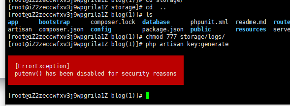
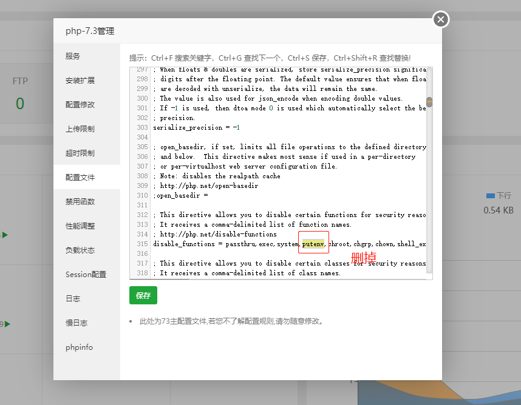
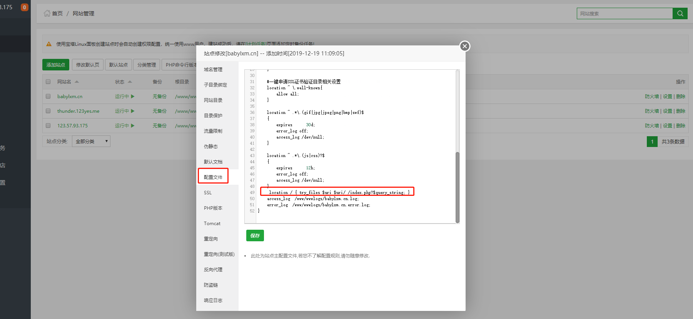

## Laravel
**1.**
`could not be opened: failed to open stream: Permission denied’ in --------------`

**这种报错是因为 文件读写没有权限  在ssh终端输入  chmod -R 777 (文件位置)； 修改权限**

**2.**
`No application encryption key has been specified.`

**这个是由于没有配置好 APP_KEY   在终端上  cd到项目目录位置 执行:
  php artisan key:generate**
  

**配置APP_KEY时  出现红框中  是因为lnmp禁用了存在危险的php函数,修改php.ini中的配置文件 putenv()  去掉**

**3.**
**在laravel中 当出现除了首页其他页面都报404时, 在nginx配置文件中添加**  `location / { try_files $uri $uri/ /index.php?$query_string; }`

## Thinkphp

**1.**
`Cannot declare class app\api\controller\User because the name is already in use`

**出现这种情况下就去检查  命名空间 以及 use 的类;  类名不能和模型名字一样**

**2.**
`403`

**在vhost文件中修改为**

`location / {
     index index.html index.htm index.php;
          #autoindex on;
         if (!-e $request_filename) {
         rewrite ^(.*)$ /index.php?s=/$1 last;
         break;
      }
  }`
 
**当访问该网站的时，nginx 会按照 index.html，index.htm ，index.php 的先后顺序在根目录中查找文件。如果这三个文件都不存在，那么nginx就会返回403 Forbidden。
   　　所以，在vhost里没有这段内容直接输入域名访问就会报403的错误，除非你在域名后面加个 /index.php才可以正常访问;**
