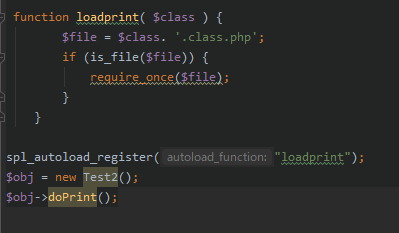
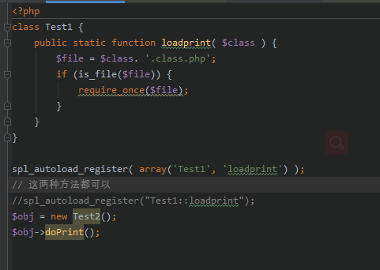

## __autoload方法、spl_autoload_register()

**tp中文件中用到的一个函数**

`1. 在test1.php文件中没有引入test2.class.php文件 ，但是可以调用其中方法。
 执行过程：
 首先执行test1.php文件，当文件实例化test2时会自动调取autoload方法，类的名称(Test2)会被当做$class的值传入，这样就引入了test2.class.php，之后调取doprint方法输出值。不过目前不常用。`

`
2. 在test1中，当实例化Test2()时，spl_autoload_register()会自动执行，
调用loadprint()，同时把Test2(需要引入文件类名)传入$class中，引入文件成功。
new Test2()换成其他名称会报错，因为对应的不是需要引入文件的类名。
`

`
3. 当在类里边去调用的时候。 方法中数组传入 文件类名及函数名称。
`

